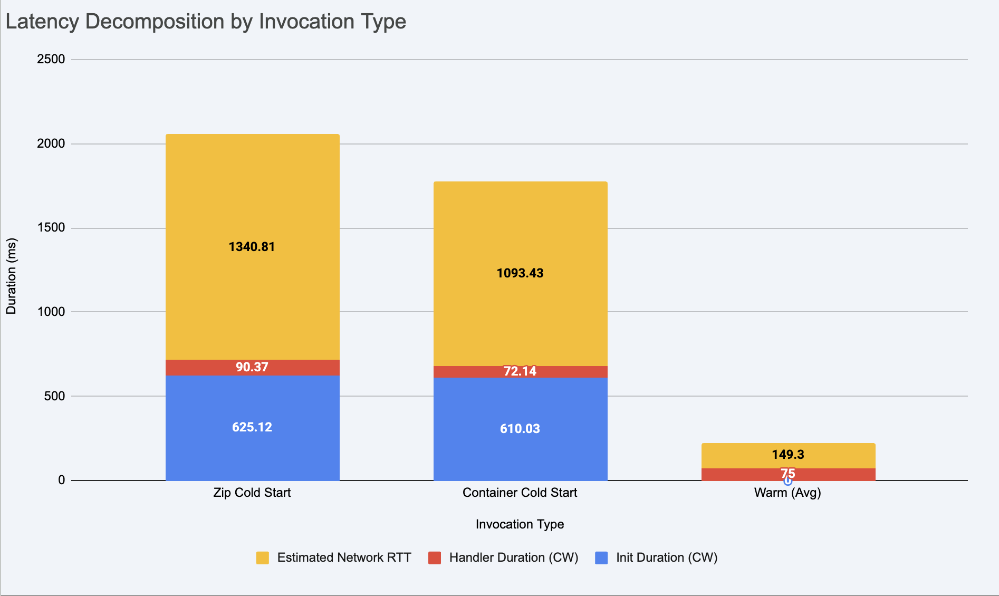

# Assignment 2:

## Create a stacked bar chart decomposing total latency into: Network RTT, Init Duration, and Handler Duration — for zip cold start, container cold start, and warm invocations.

## Estimate Network RTT as the difference between client-side total latency (from oha) and server-side time (Init Duration + Handler Duration from CloudWatch).

| Metric | Zip Cold Start | Container Cold Start | Warm Invocation (Avg) |
| :--- | :--- | :--- | :--- |
| **Client-side Total Latency** | 2056.30 ms | 1775.60 ms | 224.30 ms |
| **CloudWatch Init Duration** | 625.12 ms | 610.03 ms | 0.00 ms |
| **CloudWatch Handler Duration**| 90.37 ms | 72.14 ms | 75.00 ms |
| **Calculated Network RTT** | 1340.81 ms | 1093.43 ms | 149.30 ms |

Network RTT = Total Latency - (Init Duration + Handler Duration)

## Comment on whether zip or container cold starts are faster, and explain why.
Container cold start performed faster than Zip deployment. First successful execution was ~280ms faster than the Zip deployment.

#### Why are Containers faster?
- Lambda doesn’t download the whole container image. It only loads the parts needed to start, which makes startup faster.
- Common parts of the image (like the OS or runtime) may already be stored on the server, so they don’t need to be downloaded again.

# Assignment 3:

## Table

| Environment | Concurrency | p50 (ms) | p95 (ms) | p99 (ms) | Server avg (ms) |
| :--- | :--- | :--- | :--- | :--- | :--- |
| Lambda (zip) | 5 | 209.18 | 230.05 | **488.62** | 205.13 |
| Lambda (zip) | 10 | 203.94 | 224.14 | **481.81** | 196.43 |
| Lambda (container) | 5 | 208.03 | 232.22 | **484.32** | 201.14 |
| Lambda (container) | 10 | 207.37 | 230.87 | **482.37** | 203.82 |
| Fargate | 10 | 798.40 | 1096.20 | 1417.20 | 778.36 |
| Fargate | 50 | 3931.20 | 4196.80 | 4887.20 | 3833.81 |
| EC2 | 10 | 290.10 | 480.90 | 673.10 | 295.11 |
| EC2 | 50 | 860.80 | 1053.10 | 1816.30 | 852.31 |

Bold values -> Annotated any cell where p99 > 2× p95 (this signals tail latency instability).

## Analysis

#### Explain why Lambda p50 barely changes between c=5 and c=10 (each request gets its own execution environment), while Fargate/EC2 p50 increases significantly between c=10 and c=50 (requests queue on a single task/instance).

- Lambda handles each request in a separate execution environment, so increasing concurrency just means more environments are created. Because requests do not compete for CPU or memory, latency (p50) stays almost the same.
- In contrast, Fargate and EC2 use a single server or task, so more concurrent requests must share the same resources. At higher concurrency (50), requests start to queue, which increases latency significantly.

#### Explain what causes the latency difference between server-side `query_time_ms` and client-side p50.

- The server-side `query_time_ms` measures only the time spent processing the request inside the application. It does not include network delays or infrastructure overhead.
- Client-side p50 includes additional factors such as network RTT or connection setup.